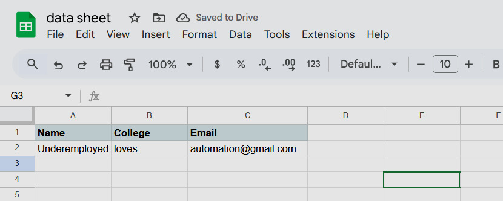
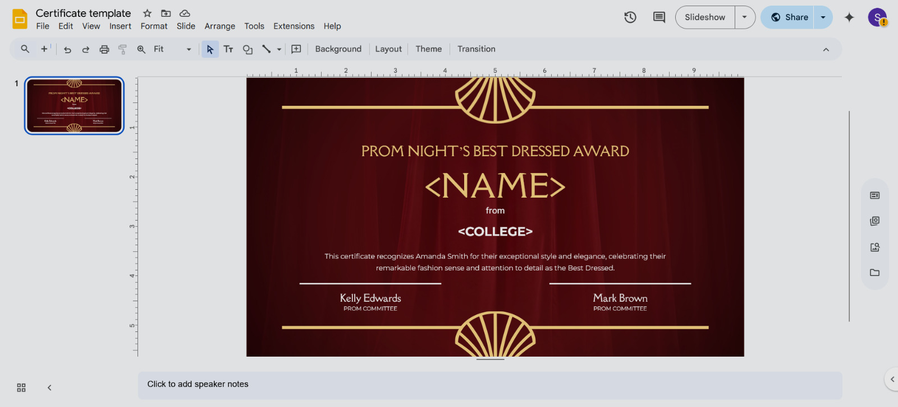

# Certificate Sharing Tool

An automated tool for generating and sharing certificates using Google Apps Script and Google Sheets.

## Overview

This tool automates the process of creating personalized certificates and sharing them via email. It uses Google Sheets to manage recipient data and Google Apps Script to generate certificates from a template and send them automatically.

## How It Works

The system consists of:
- **Google Sheet**: Contains recipient information and tracks certificate status
- **Google Apps Script**: Handles certificate generation and email distribution
- **Certificate Template**: Base template for generating personalized certificates

## Setup Instructions

### 1. Folder Structure
Your Google Drive should be organized as shown below:


### 2. Google Sheet Setup
Create a Google Sheet with recipient information:



Required columns (case insensiteve):
- Recipents college   -> college
- Recipient names  -> name
- Email addresses  -> email
- Any other personalization data needed for certificates

### 3. Certificate Template
Prepare your certificate template in Google Slides or Docs:



### 4. Apps Script Configuration
Configure the Apps Script with your specific variables:

Update these variables in the script:
```javascript
var eventName = "Master the Basics of Flutter";
var SocietyName = "ISTE SC GECBH";
var slideTemplateUrl = "YOUR_SLIDE_TEMPLATE_URL";
var tempFolderUrl = "YOUR_TEMP_FOLDER_URL";
var sheetUrl = "YOUR_SHEET_URL";
```


Key configuration variables:
- Sheet ID
- Template document ID
- Folder IDs for storing generated certificates
- Email settings

## Usage

1. **Prepare your data**: Fill the Google Sheet with recipient information
2. **Configure the script**: Update the configuration variables in Apps Script
3. **Run the script**: Execute the certificate generation and sharing process
4. **Monitor progress**: Check the status sheet for completion and any errors

## Limitations & Important Notes

### Google Workspace Limits
- **Email limit**: 100 emails per day for standard Gmail accounts
- **Script timeout**: Apps Script has execution time limits that may cause timeouts for large batches
- **API quotas**: Various Google API limits may apply

### Common Issues & Troubleshooting

Most errors will be visible in:
- Excel status sheet
- Apps Script execution logs

**Common solutions**:
- **Re-run with different account**: Sometimes using a different Google account with proper access permissions resolves issues
- **Retry with same account**: Simple retry often works for temporary timeouts
- **Check permissions**: Ensure the script has access to all required Google Drive folders and sheets

**Typical causes of issues**:
- Email daily limit reached (100 emails)
- Script execution timeout due to large batch size
- Permission/access issues with Google Drive folders
- Unaccounted edge cases in recipient data

## Disclaimer

This tool was only written for the purpose of solving my own personal requirements.

I decided to make this public on GitHub because:
- It was useful for me, so maybe it'll be useful for others in the future.
- Future me might be thankful if I ever need to do this again.
- This README was generated with AI assistance. If you encounter any issues, please submit them as issue.


With that said, please bear in mind that this tool won't be actively maintained and your mileage may vary. I'm sure it's far from perfect so if you choose to use it please proceed with caution and be careful to verify the results! I hope it's helpful.


## Disclaimer

This tool was only written for the purpose of solving my own personal requirements.

I decided to make this public on GitHub because:

- It was useful for me, so maybe it'll be useful for others in the future.
- Future me might be thankful if I ever need to do this again.

With that said, please bear in mind that this tool won't be actively maintained and your mileage may vary. I'm sure it's far from perfect so if you choose to use it please proceed with caution and be careful to verify the results! I hope it's helpful.

Good luck with your certificate generation.